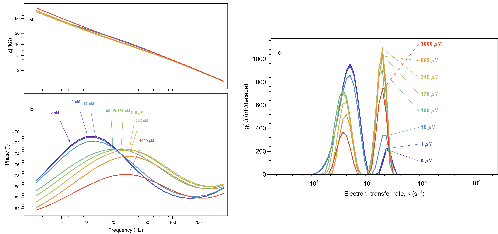

# DCT: Distribution of Capacitance Timescales

Electrochemical impedance spectroscopy (EIS) analysis toolkit for surface-immobilized redox systems. It inverts EIS data into a distribution of electron-transfer rate constants g(k), using a Maxwell admittance ladder, Tikhonov regularization and non-negative least squares (NNLS).

First application: electrochemical aptamer-based (EAB) vancomycin sensors, where binding shifts capacitance between a slow (unfolded) and a fast (folded) electron-transfer population.



*Measured impedance (magnitude and phase) across the vancomycin concentration series: the spectra that DCT inverts into g(k).*

---

## Requirements

| Requirement | Version tested | Notes |
|---|---|---|
| Wolfram Mathematica | 13.1 | Provides the kernel |
| VS Code | any recent | |
| [Wolfbook VS Code extension](https://marketplace.visualstudio.com/items?itemName=wolfbook.wolfbook) | 2.10.1 | Opens the `.wb` notebooks and connects them to the kernel |

The `.wb` notebooks need VS Code with Wolfbook; they do not open in the Mathematica front end. The `.wl` packages are plain Wolfram Language and load anywhere.

## Quick start

1. Clone the repository and open the folder in VS Code.
2. Open `EAB_DCT_analysis.wb`. The saved outputs (plots, tables) are visible straight away.
3. To reproduce them, run the notebook top to bottom. All paths are relative to the notebook's folder (`NotebookDirectory[]`), so no editing is needed.

Figures and tables for the paper are written to `data/figures/` (PDF and 300 dpi PNG) while `exportFigure = True` (set in Section 6.1).

---

## Repository layout

```
DCT/
├── EAB_DCT_analysis.wb     main analysis notebook: start here
├── cv_analysis.wb          cyclic voltammograms of the titration electrodes (figure cv_raw)
├── CV_plot.wb              single-CV plotting example (expects data/CV/sample_CV_bon.txt, not included)
├── biophysics_sensitivity.wb   sensitivity of the aptamer folding model to its parameters
├── runTests.wb             runs the test suite
├── DCT.wl                  main loader: Get this to load every package below
├── core/
│   ├── NNLSFit.wl          non-negative least squares (Lawson-Hanson)
│   ├── DataImport.wl       reads the .txt EIS exports
│   ├── KKCheck.wl          linearized Kramers-Kronig check in admittance space
│   ├── DCTKernel.wl        Maxwell ladder, Tikhonov regularization, forward model
│   ├── DCTSpectrum.wl      DCTSpectrum[] entry point (outer Brent loop)
│   └── CPEFit.wl           equivalent-circuit fit Rs + Cdl||(Rct + CPE)
├── analysis/
│   ├── PeakAnalysis.wl     peak finding, spectrum integration
│   ├── Sensitivity.wl      parameter-sweep utilities
│   ├── AdmittanceStats.wl  per-frequency admittance variance and power-law fit
│   └── Biophysics.wl       3- and 4-state aptamer folding models (symbolic + fitting)
├── plots/                  plot functions; every figure has a dark and a publication (white) theme
│   └── vendor/CustomTicks/ vendored tick library (MIT), kept for reference, not loaded
├── tests/                  unit and regression tests (see "Running tests")
├── data/
│   ├── 1_TitrationA_2026-02-25/   series A titration: EIS/ and CV/
│   ├── 2_TitrationB_2026-03-24/   series B titration: EIS/ and CV/
│   ├── 3_Drift_2026-03-24/        24 h stability run of the series B electrodes: EIS/
│   ├── figures/                   exported figures (generated)
│   └── SI/                        Kramers-Kronig replication files for the SI (generated)
└── img/                    plot images shown in the saved notebook outputs (written by Wolfbook)
```

## Data

| Folder | What | Files |
|---|---|---|
| `1_TitrationA_2026-02-25/EIS` | Series A: electrodes A1 to A3, 0 to 250 µM vancomycin | `EIS_100uM_E1.txt` |
| `2_TitrationB_2026-03-24/EIS` | Series B: electrodes B1 to B3, 0 to 1000 µM vancomycin | `E1_EIS_100uM.txt` |
| `3_Drift_2026-03-24/EIS` | The same B electrodes held at 1000 µM for 24 h, straight after the B titration | `E1_EIS_(0).txt` (file number = time order) |
| `*/CV` | Staircase cyclic voltammograms for `cv_analysis.wb` | `.txt` exports |

Every spectrum has 51 frequencies from 0.1 Hz to 10 kHz. In the file names, `E1`/`E2`/`E3` is the electrode on the chip; the notebook maps them to A1 to A3 or B1 to B3 by folder.

The EIS files are plain text with a header line (frequency, Re Z, −Im Z). `DCTDataImport`ImportEIS` normalizes the header strings and accepts the common variants (`Re(Z)`, `Zre`, `Z'`, and so on).

---

## `EAB_DCT_analysis.wb`

Run top to bottom. Each section sets the values the next ones use.

| Section | What it does |
|---|---|
| 0 Setup | 0.1 loads the packages; 0.2 holds the data folders and the fit parameters |
| Method validation | recovers a known three-peak g(k) from simulated EIS |
| 1 Kramers-Kronig | linearized Kramers-Kronig check of every drift spectrum; the median lower end of the valid range sets `fMinHz` (1.3). 1.4 is the worked example for the SI, with CSV files in `data/SI/` |
| 2 Admittance statistics | variance of \|Y\| against its mean over the drift run: sets `fMaxHz` (2.3) and the weighting exponent `weightPower` from the power-law fit (2.6) |
| 3 Parameter tuning | λ sweep and L-curve for the regularization parameter |
| 4 Drift fit | fits every drift spectrum; 4a plots the 24 h run (capacitance loss, modes, fast fraction, publication figure) |
| 5 Concentration analysis | fits every titration spectrum: g(k), raw EIS, Nyquist and admittance figures, mode capacitance, fraction folded, per-state rates; 5a fits the folding models |
| 6 Export | writes the publication figures |
| 7 Sensitivity analysis | sweeps every tunable parameter one at a time; 7.6 is the elasticity table |
| 8 Rs = 0 | refit without the solution resistance |
| 9 Parallel resistor | a resistor in parallel with the ladder instead of in series |
| 10 Upper-cutoff figures | publication figures for the fMaxHz sweep |

Fit parameters as used in the paper:

| Parameter | Value | Set in |
|---|---|---|
| `fMinHz` | 2.51 Hz | 1.3 (median lower end of the Kramers-Kronig valid range) |
| `fMaxHz` | 500 Hz (highest fitted frequency 398 Hz) | 2.3 |
| `weightPower` | −0.87 (weights \|Y\|^p) | 2.6 |
| `lambdaND` | 10⁻³ | 0.2, from the L-curve in 3a |
| `binsPerDecade` | 15 | 0.2 |
| `tauMinFactor`, `tauMaxFactor` | 0.1, 10 (k grid padded one decade each side) | 0.2 |

`fMaxHz` and `weightPower` also have starting values in 0.2; Sections 2.3 and 2.6 overwrite them from the data.

---

## Biophysical model (Section 5a)

Two kinetic models are fitted to the fraction folded against [ligand], using the symbolic derivations in `analysis/Biophysics.wl`:

| Model | States | Parameters |
|---|---|---|
| 3-state | U ↔ F ↔ B | K_S (structural switching), K_D (ligand dissociation) |
| 4-state | U ↔ F ↔ B, plus NF (non-folding) | K_S, K_D, NF |

The fraction folded at zero ligand follows from the model as K_S / (1 + K_S). The 4-state NF parameter absorbs the shortfall from full saturation, so its K_D is typically much smaller than the 3-state K_D. Both model equations are printed symbolically before fitting.

---

## Running tests

Open `runTests.wb` and run all cells, or run a test file from a terminal:

```
wolframscript -file tests/TestDataImport.wl
wolframscript -file tests/TestNNLS.wl
wolframscript -file tests/TestDCTKernel.wl
wolframscript -file tests/TestDCTInversion.wl
wolframscript -file tests/TestCPEFit.wl
wolframscript -file tests/TestBiophysics.wl
```

All tests should report 0 failures. The outward-tick regression tests (`tests/TestPlotTicks.wl`) run from `runTests.wb`.

---

## Known issue: plots disappearing in Wolfbook on Windows

In Wolfbook 2.10.1, the image clean-up deletes plots from `img/` about a minute after they are drawn, so after a full run most outputs show as missing images. The cause is a path comparison in the extension's `out/extension/execution/checkout.js` (`cleanupImgDir`): the stored paths contain doubled backslashes and never match the files on disk. Until it is fixed upstream, re-running a cell restores its plot.

---

## Optional: Claude Code with the Wolfbook MCP server

Wolfbook includes an MCP server that lets Claude Code read, edit and run notebook cells.

1. The bridge script is installed with the extension at
   `%USERPROFILE%\.vscode\extensions\wolfbook.wolfbook-<VERSION>-win32-x64\out\extension\claude-mcp\stdio-bridge.js`.
2. Add it to `~/.claude.json`, both in the global `mcpServers` block and in the block for this project folder (the project block alone is not picked up by the VS Code extension panel):

```json
{
  "mcpServers": {
    "wolfbook": {
      "type": "stdio",
      "command": "node",
      "args": ["C:\\Users\\<YOU>\\.vscode\\extensions\\wolfbook.wolfbook-<VERSION>-win32-x64\\out\\extension\\claude-mcp\\stdio-bridge.js"],
      "env": {}
    }
  },
  "projects": {
    "C:\\Users\\<YOU>\\path\\to\\DCT": {
      "mcpServers": {
        "wolfbook": {
          "type": "stdio",
          "command": "node",
          "args": ["C:\\Users\\<YOU>\\.vscode\\extensions\\wolfbook.wolfbook-<VERSION>-win32-x64\\out\\extension\\claude-mcp\\stdio-bridge.js"],
          "env": {}
        }
      }
    }
  }
}
```

3. With a `.wb` file open, run **Wolfbook Claude MCP** from the command palette (`Ctrl+Shift+P`).
4. Restart VS Code (it can take two or three restarts before the server is recognised), then check with `/mcp` in Claude Code.

The bridge needs [Node.js](https://nodejs.org/) 18 or later.

---

## Acknowledgments and third-party code

- **CustomTicks** (`plots/vendor/CustomTicks/`): log-aware tick generation, © 2021 Mark A. Caprio, MIT License (full text in `plots/vendor/CustomTicks/LICENSE.md`), part of the LevelScheme package. Kept for reference; the plots use the self-contained outward-tick generators in `plots/PlotTheme.wl`, and CustomTicks is not loaded.
- **NNLS** (`core/NNLSFit.wl`): adapted from **Michael Woodhams's** Mathematica implementation of the **Lawson-Hanson** active-set algorithm (Lawson and Hanson, *Solving Least Squares Problems*, Prentice-Hall 1974 / SIAM 1995), posted to comp.soft-sys.math.mathematica on 2 Oct 2003. Woodhams placed the code in the public domain and asks that his authorship be acknowledged. [Original thread](https://groups.google.com/g/comp.soft-sys.math.mathematica/c/cHFiKQ8ssaI) · [Stack Exchange repost](https://mathematica.stackexchange.com/questions/269727).
